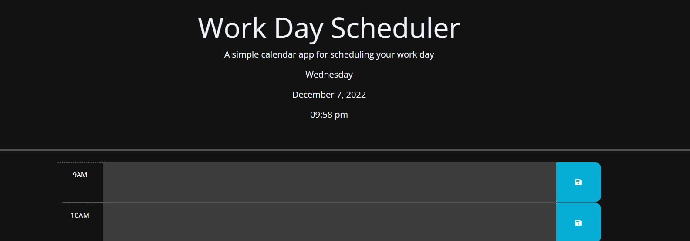

# Work Day Scheduler

## Description

This page will serve as a schedule for a user.

## Table of contents

-[Header](#display-3)

-[The time](#weekDay)

-[Start of schedule](#hour-9)

## Installation

This page shows the coding repository: https://github.com/KobyS82/Work-Day-Scheduler

## Usage

This page can be viewed live at https://kobys82.github.io/Work-Day-Scheduler/

 

## Credits

Mirzaleka, for DayJs, https://mirzaleka.medium.com/the-complete-guide-to-day-js-fb835a5d945a

DayJs, for DayJs Format, https://day.js.org/docs/en/plugin/advanced-format

jQuery, for jQuery Documentation, https://api.jquery.com/css/

w3schools, for jQuery examples and htmlDOM and string manipulation, https://www.w3schools.com/jquery/jquery_dom_set.asp, https://www.w3schools.com/js/js_htmldom_navigation.asp, https://www.w3schools.com/js/js_string_methods.asp

proMaker Dev, for Local Storage help, https://www.youtube.com/watch?v=fYTTUBa-lPc
